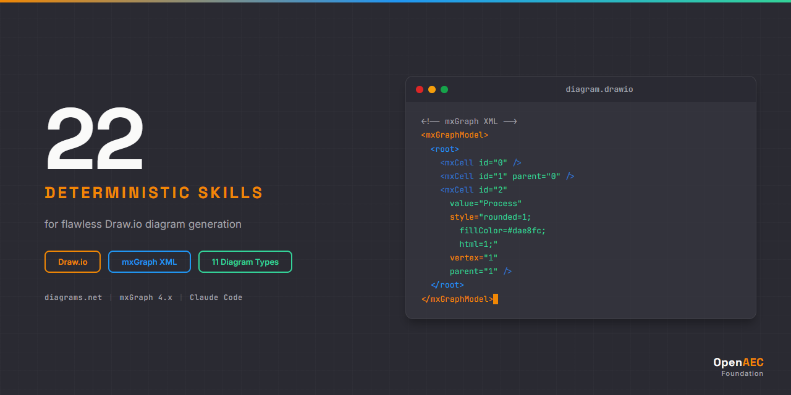

# Draw.io Claude Skill Package

  

## Overview

22 deterministic Claude skills for programmatic Draw.io diagram generation. Covers the complete mxGraph XML ecosystem: format, styles, geometry, 11 diagram types, error diagnosis, and intelligent orchestration.

## Skills

| Category | Skills | Purpose |
|----------|--------|---------|
| Core | 3 | XML format, style system, geometry |
| Syntax | 4 | Cells, connections, styles, metadata |
| Implementation | 11 | Flowcharts, swimlanes, architecture, ER, BPMN, UML, mind maps, network, templates, CSV import, Mermaid |
| Errors | 2 | XML errors, rendering issues |
| Agents | 2 | Diagram generator, code validator |
| **Total** | **22** | |

## Installation

### As Claude Code Skills

Copy the `skills/source/` directory into your project or reference via git submodule.

### With MCP Servers

This package includes `.mcp.json` with two pre-configured MCP servers:

- **drawio-mcp-server** (lgazo) — Full CRUD on diagram elements
- **@drawio/mcp** (jgraph, official) — Open diagrams in Draw.io editor

## Technology

- **Draw.io / diagrams.net** — Open source (Apache 2.0)
- **mxGraph XML format** — Version 4.x compatible
- **Claude Code** — Designed for Claude Code skill system

## Methodology

Built using the proven 7-phase research-first methodology. 4 deep research documents (3800+ lines), refined masterplan with agent prompts, 8 quality-gated batches.

## License

MIT

## Author

OpenAEC Foundation
