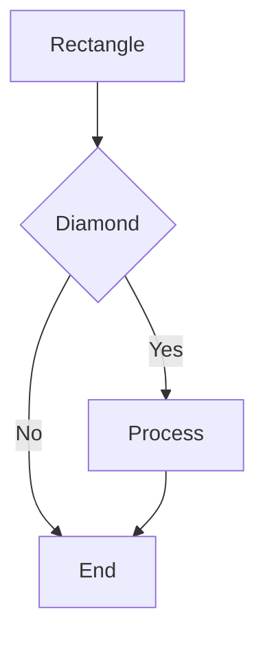
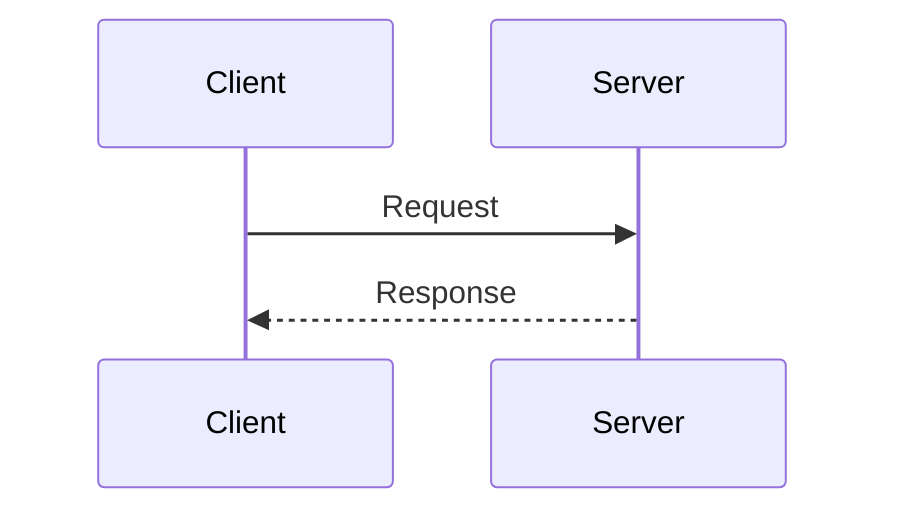
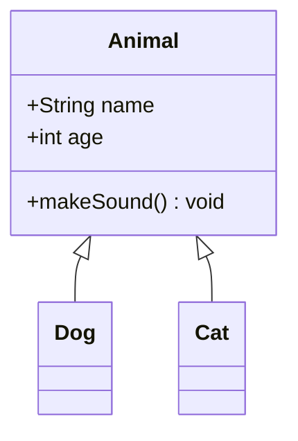
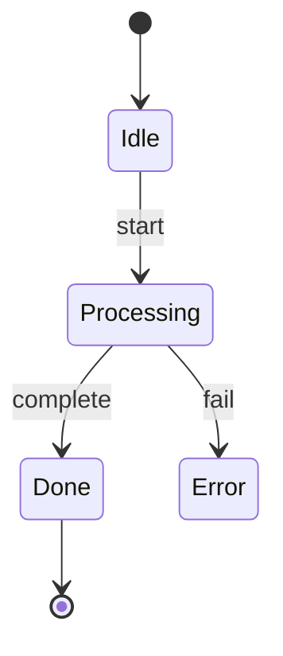
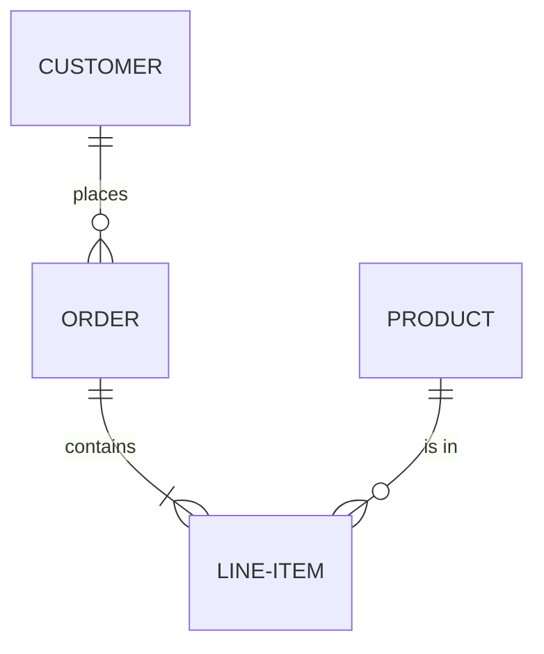
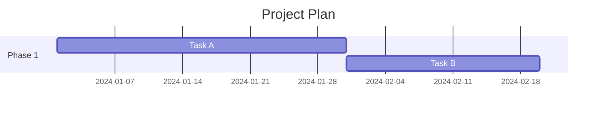
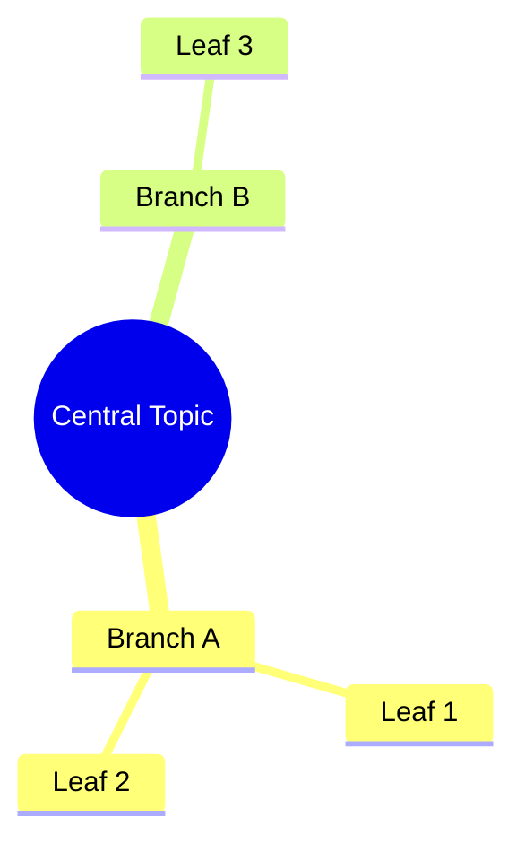

# Draw.io Mermaid Conversion

## Purpose

This skill enables correct use of Mermaid diagram conversion in Draw.io. It prevents the most critical AI mistake: assuming Mermaid conversion produces individual mxCells (it does NOT — it produces a single compound shape). It covers supported diagram types, the `open_drawio_mermaid` MCP tool, limitations, and the decision framework for choosing between Mermaid and native mxGraph XML.

## Critical Rules (Memorize These)

1. **NEVER use Mermaid when individual cell editability is required.** Mermaid conversion produces a SINGLE compound shape — NOT separate mxCells. You CANNOT select, move, restyle, or connect to individual nodes after conversion.
2. **ALWAYS use native mxGraph XML for production diagrams.** Mermaid is ONLY for quick visualization, prototyping, or self-contained read-only diagrams.
3. **NEVER attempt MCP CRUD operations on Mermaid-converted shapes.** The drawio-mcp-server (lgazo) `edit_cell`, `delete_cell`, `move_cell`, and `restyle` tools will NOT work on individual nodes inside a Mermaid compound shape.
4. **ALWAYS validate Mermaid syntax before calling `open_drawio_mermaid`.** Invalid syntax produces a blank diagram with no error feedback.
5. **NEVER mix Mermaid compound shapes with native mxCells on the same canvas** when programmatic manipulation is needed — the Mermaid block cannot interact with native cells.
6. **ALWAYS use the `content` parameter** (not `data` or `xml`) when calling `open_drawio_mermaid`.

## The Compound Shape Problem

This is the single most important fact about Mermaid in Draw.io:

```
Mermaid text --> Draw.io renders --> ONE compound shape (grouped SVG)
                                     NOT individual <mxCell> elements
```

| Capability | Native mxGraph XML | Mermaid Import |
|-----------|-------------------|----------------|
| Individual cell access | YES | NO |
| Style editing per shape | YES | NO |
| Programmatic connections | YES | NO |
| MCP server CRUD | YES | NO |
| Pixel-level positioning | YES | NO |
| Layout control | Full | Mermaid engine decides |
| Source readability | Low (XML) | High (text) |
| Generation speed | Slower | Faster |

## Decision Tree: Mermaid vs Native XML

```
Will individual shapes be edited after creation?
  YES --> Use native mxGraph XML. STOP.
  NO  --> Continue.

Will MCP server tools manipulate the diagram?
  YES --> Use native mxGraph XML. STOP.
  NO  --> Continue.

Does the diagram need precise pixel positioning?
  YES --> Use native mxGraph XML. STOP.
  NO  --> Continue.

Must shapes connect to other elements on the canvas?
  YES --> Use native mxGraph XML. STOP.
  NO  --> Continue.

Is this a quick prototype or read-only visualization?
  YES --> Mermaid is acceptable.
  NO  --> Use native mxGraph XML.
```

**Summary:** If ANY of the first four questions is YES, ALWAYS use native mxGraph XML.

## Supported Mermaid Diagram Types

| Mermaid Type | Keyword | Best For |
|-------------|---------|----------|
| Flowchart | `graph` or `flowchart` | Process flows, decision trees |
| Sequence Diagram | `sequenceDiagram` | API calls, message passing |
| Class Diagram | `classDiagram` | OOP structure, UML class diagrams |
| State Diagram | `stateDiagram` or `stateDiagram-v2` | State machines, lifecycle flows |
| ER Diagram | `erDiagram` | Database schemas, entity relationships |
| Gantt Chart | `gantt` | Project timelines, scheduling |
| Pie Chart | `pie` | Proportional data visualization |
| Git Graph | `gitgraph` | Branch and merge visualization |
| Mindmap | `mindmap` | Hierarchical brainstorming |
| Requirement Diagram | `requirementDiagram` | Requirements traceability |
| User Journey | `journey` | User experience mapping |
| C4 Context | `C4Context` | Software architecture (C4 model) |
| Quadrant Chart | `quadrantChart` | 2x2 matrix analysis |

## MCP Tool: open_drawio_mermaid

The official `@drawio/mcp` server (by jgraph) provides `open_drawio_mermaid`.

### Parameters

| Parameter | Type | Required | Description |
|-----------|------|----------|-------------|
| `content` | string | YES | The Mermaid diagram definition |
| `dark` | string | NO | Dark mode: `"auto"`, `"true"`, `"false"`. Default: `"auto"` |
| `lightbox` | boolean | NO | Read-only view mode. Default: `false` |

### Usage Pattern

```
open_drawio_mermaid(
  content: "graph TD\n  A[Start] --> B{Decision}\n  B -->|Yes| C[Action]\n  B -->|No| D[End]"
)
```

### What Happens After the Call

1. Draw.io editor opens in the browser
2. The Mermaid text is rendered as a single compound shape
3. The user sees the diagram but CANNOT select individual nodes
4. To edit: select the shape, press Enter, modify the Mermaid source text

## Mermaid Syntax Quick Reference

### Flowchart



Direction keywords: `TD` (top-down), `LR` (left-right), `BT` (bottom-top), `RL` (right-left).

Node shapes: `[text]` rectangle, `{text}` diamond, `(text)` rounded, `([text])` stadium, `[[text]]` subroutine, `[(text)]` cylinder, `((text))` circle, `>text]` asymmetric.

### Sequence Diagram



Arrow types: `->>` solid with arrowhead, `-->>` dashed with arrowhead, `-x` solid with cross, `--x` dashed with cross.

### Class Diagram



### State Diagram



### ER Diagram



Cardinality: `||` exactly one, `o|` zero or one, `}|` one or more, `}o` zero or more.

### Gantt Chart



### Mindmap



## Conversion Methods (Beyond MCP)

### Method 1: URL Parameter

```json
{"type": "mermaid", "compressed": true, "data": "BASE64_DEFLATED_MERMAID_TEXT"}
```

### Method 2: Draw.io UI

**Arrange > Insert > Mermaid** or the `+` toolbar icon > Mermaid.

### Method 3: Embed Mode postMessage

```json
{"action": "load", "descriptor": {"format": "mermaid", "data": "graph TD; A-->B;"}}
```

### Method 4: ELK Layout Option

Draw.io supports the Mermaid ELK layout engine for more compact flowcharts. This is activated within the Mermaid source by using `%%{init: {'flowchart': {'defaultRenderer': 'elk'}}}%%` at the top.

## Workarounds for the Compound Shape Limitation

When you need BOTH Mermaid readability AND individual cell control:

### Workaround 1: Mermaid as Specification, XML as Output

1. Write the diagram logic in Mermaid syntax (for human review)
2. Translate the Mermaid structure into native mxGraph XML
3. Generate the XML with individual mxCells for each node and edge
4. This gives you readable specification AND full editability

### Workaround 2: Two-Phase Approach

1. Use `open_drawio_mermaid` for initial visualization and stakeholder review
2. Once approved, recreate the diagram in native mxGraph XML for production use
3. Discard the Mermaid version

### Workaround 3: Side-by-Side on Separate Pages

1. Put the Mermaid compound shape on Page 1 (reference view)
2. Put the native mxGraph XML version on Page 2 (editable version)
3. Maintain both as needed

**NEVER attempt to "ungroup" or "explode" a Mermaid compound shape into individual cells.** This is NOT supported by Draw.io.

## Reference Links

- [Complete Reference](references/methods.md)
- [Working Examples](references/examples.md)
- [Anti-Patterns](references/anti-patterns.md)
