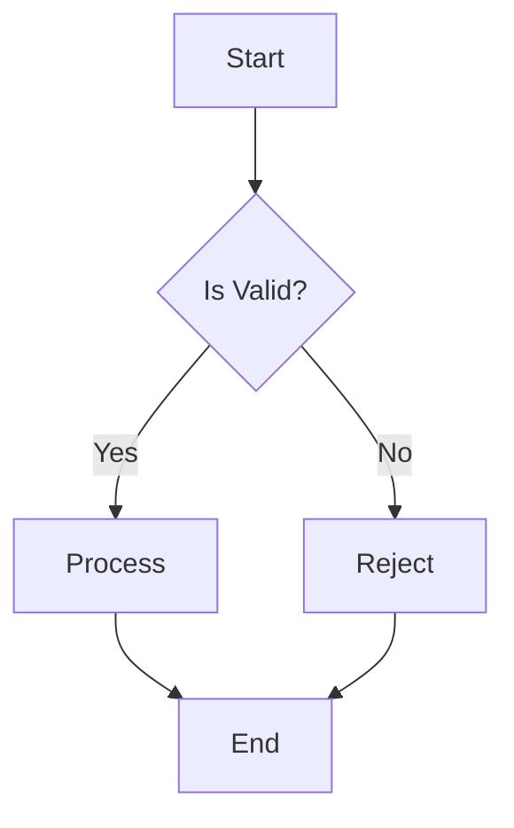
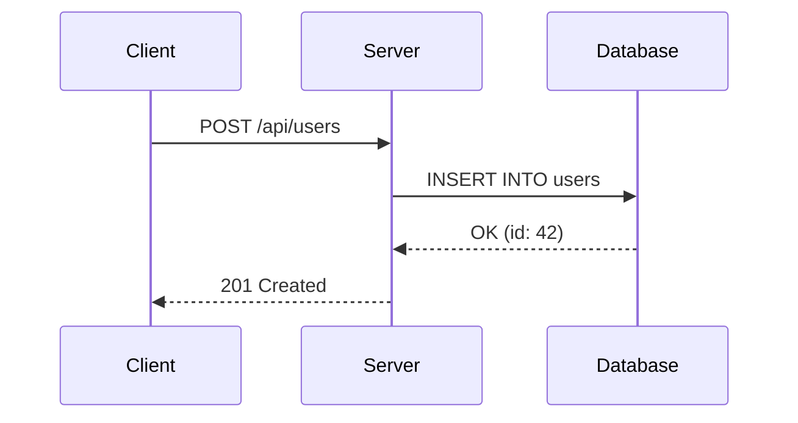
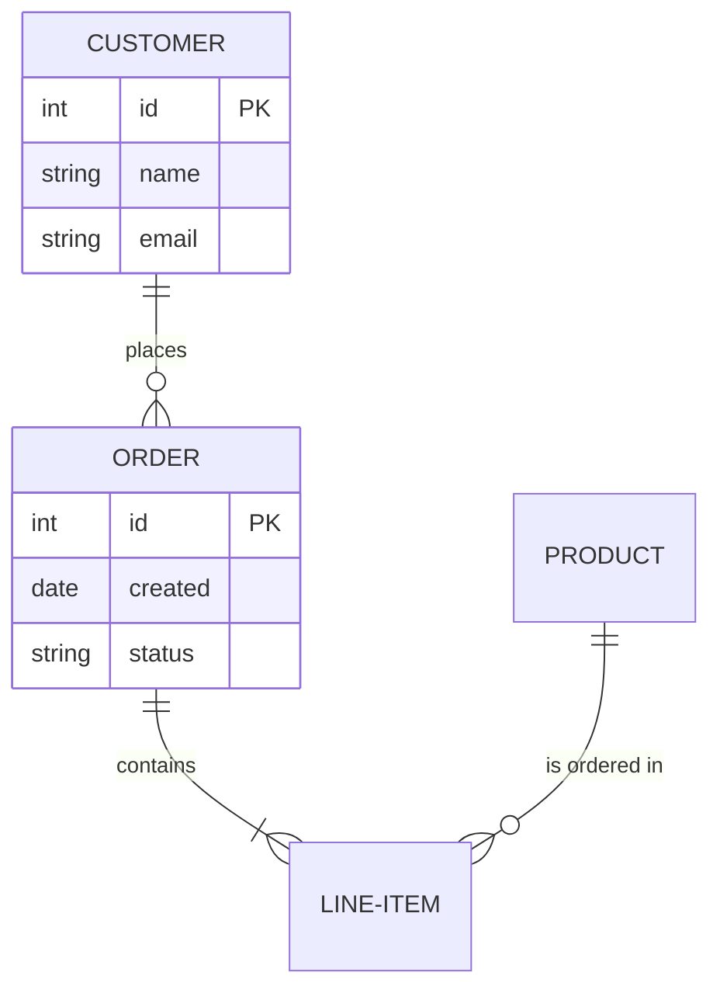
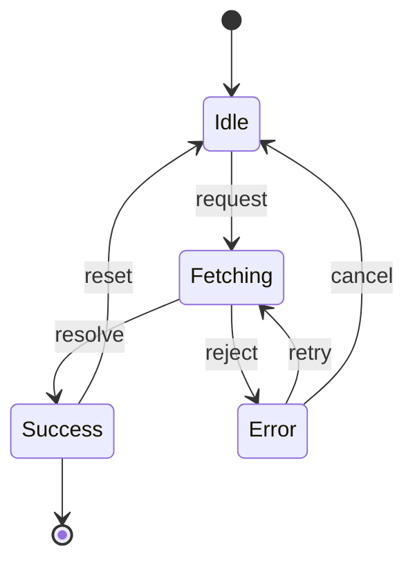
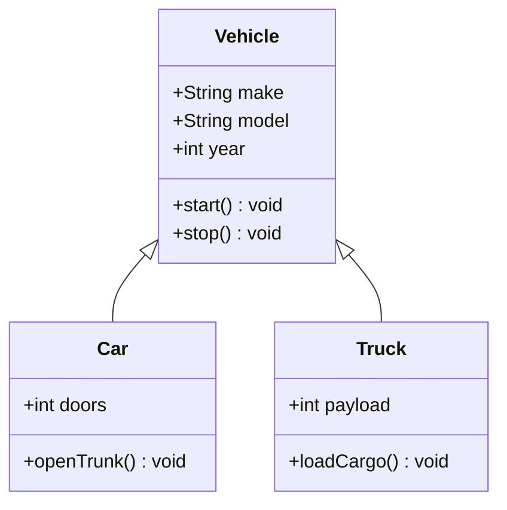
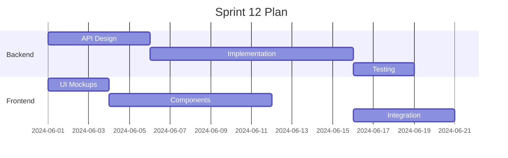
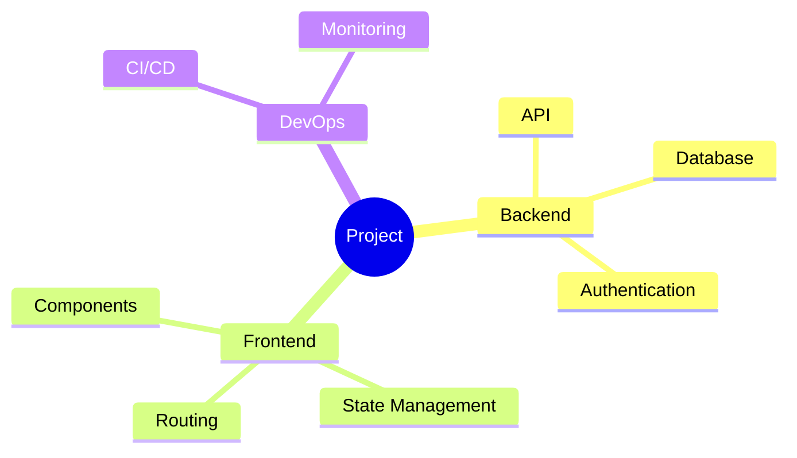
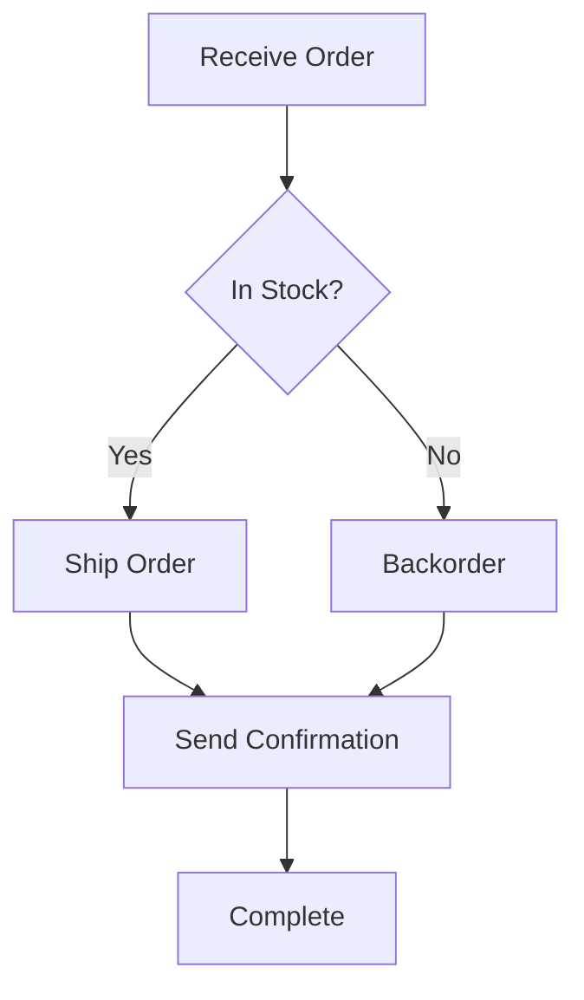
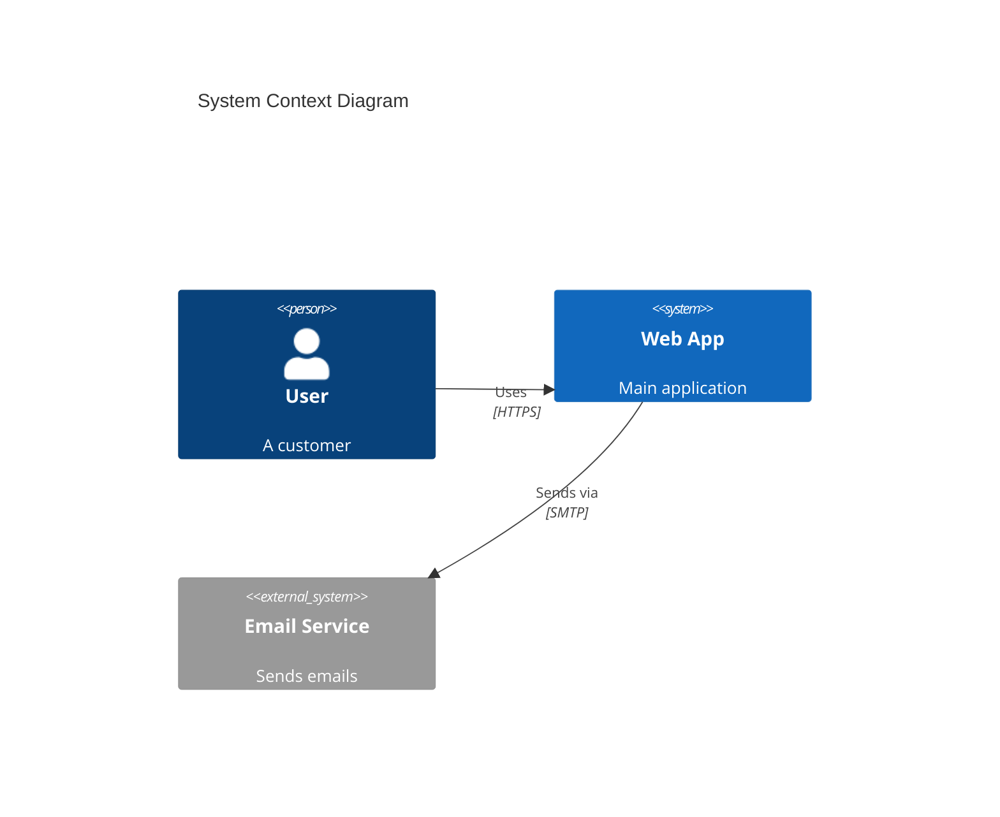

# Examples: Mermaid Conversion

Working examples for Mermaid-to-Draw.io conversion. Each example shows the Mermaid source and how to invoke it via the MCP tool.

---

## 1. Simple Flowchart via MCP Tool

The simplest valid Mermaid conversion using `open_drawio_mermaid`.

### Mermaid Source



### MCP Tool Call

```
open_drawio_mermaid(
  content: "graph TD\n  A[Start] --> B{Is Valid?}\n  B -->|Yes| C[Process]\n  B -->|No| D[Reject]\n  C --> E[End]\n  D --> E"
)
```

### Result

A single compound shape containing the entire flowchart. The user CANNOT select individual nodes.

---

## 2. Sequence Diagram

### Mermaid Source



### MCP Tool Call

```
open_drawio_mermaid(
  content: "sequenceDiagram\n  participant C as Client\n  participant S as Server\n  participant D as Database\n  C->>S: POST /api/users\n  S->>D: INSERT INTO users\n  D-->>S: OK (id: 42)\n  S-->>C: 201 Created"
)
```

---

## 3. ER Diagram

### Mermaid Source



### MCP Tool Call

```
open_drawio_mermaid(
  content: "erDiagram\n  CUSTOMER ||--o{ ORDER : places\n  ORDER ||--|{ LINE-ITEM : contains\n  PRODUCT ||--o{ LINE-ITEM : \"is ordered in\"\n  CUSTOMER {\n    int id PK\n    string name\n    string email\n  }\n  ORDER {\n    int id PK\n    date created\n    string status\n  }"
)
```

---

## 4. State Diagram

### Mermaid Source



### MCP Tool Call

```
open_drawio_mermaid(
  content: "stateDiagram-v2\n  [*] --> Idle\n  Idle --> Fetching : request\n  Fetching --> Success : resolve\n  Fetching --> Error : reject\n  Success --> Idle : reset\n  Error --> Fetching : retry\n  Error --> Idle : cancel\n  Success --> [*]"
)
```

---

## 5. Class Diagram

### Mermaid Source



### MCP Tool Call

```
open_drawio_mermaid(
  content: "classDiagram\n  class Vehicle {\n    +String make\n    +String model\n    +int year\n    +start() void\n    +stop() void\n  }\n  class Car {\n    +int doors\n    +openTrunk() void\n  }\n  class Truck {\n    +int payload\n    +loadCargo() void\n  }\n  Vehicle <|-- Car\n  Vehicle <|-- Truck"
)
```

---

## 6. Gantt Chart

### Mermaid Source



### MCP Tool Call

```
open_drawio_mermaid(
  content: "gantt\n  title Sprint 12 Plan\n  dateFormat YYYY-MM-DD\n  section Backend\n  API Design     :a1, 2024-06-01, 5d\n  Implementation :a2, after a1, 10d\n  Testing        :a3, after a2, 3d\n  section Frontend\n  UI Mockups     :b1, 2024-06-01, 3d\n  Components     :b2, after b1, 8d\n  Integration    :b3, after a2, 5d"
)
```

---

## 7. Mindmap

### Mermaid Source



### MCP Tool Call

```
open_drawio_mermaid(
  content: "mindmap\n  root((Project))\n    Backend\n      API\n      Database\n      Authentication\n    Frontend\n      Components\n      State Management\n      Routing\n    DevOps\n      CI/CD\n      Monitoring"
)
```

---

## 8. Dark Mode and Lightbox

### Dark Mode

```
open_drawio_mermaid(
  content: "graph LR\n  A[Input] --> B[Process] --> C[Output]",
  dark: "true"
)
```

### Lightbox (Read-Only)

```
open_drawio_mermaid(
  content: "graph LR\n  A[Input] --> B[Process] --> C[Output]",
  lightbox: true
)
```

---

## 9. Workaround: Mermaid as Spec, XML as Output

This example shows the recommended two-step approach when you need both Mermaid readability and individual cell control.

### Step 1: Write the Mermaid Spec (For Human Review)



### Step 2: Generate Native mxGraph XML (For Production)

```xml
<mxGraphModel>
  <root>
    <mxCell id="0" />
    <mxCell id="1" parent="0" />
    <mxCell id="A" value="Receive Order" style="rounded=0;whiteSpace=wrap;html=1;fillColor=#dae8fc;strokeColor=#6c8ebf;" vertex="1" parent="1">
      <mxGeometry x="190" y="40" width="140" height="60" as="geometry" />
    </mxCell>
    <mxCell id="B" value="In Stock?" style="rhombus;whiteSpace=wrap;html=1;fillColor=#fff2cc;strokeColor=#d6b656;" vertex="1" parent="1">
      <mxGeometry x="200" y="140" width="120" height="80" as="geometry" />
    </mxCell>
    <mxCell id="C" value="Ship Order" style="rounded=0;whiteSpace=wrap;html=1;fillColor=#d5e8d4;strokeColor=#82b366;" vertex="1" parent="1">
      <mxGeometry x="60" y="270" width="140" height="60" as="geometry" />
    </mxCell>
    <mxCell id="D" value="Backorder" style="rounded=0;whiteSpace=wrap;html=1;fillColor=#f8cecc;strokeColor=#b85450;" vertex="1" parent="1">
      <mxGeometry x="320" y="270" width="140" height="60" as="geometry" />
    </mxCell>
    <mxCell id="E" value="Send Confirmation" style="rounded=0;whiteSpace=wrap;html=1;fillColor=#dae8fc;strokeColor=#6c8ebf;" vertex="1" parent="1">
      <mxGeometry x="190" y="380" width="140" height="60" as="geometry" />
    </mxCell>
    <mxCell id="F" value="Complete" style="rounded=1;whiteSpace=wrap;html=1;arcSize=50;fillColor=#e1d5e7;strokeColor=#9673a6;" vertex="1" parent="1">
      <mxGeometry x="200" y="480" width="120" height="40" as="geometry" />
    </mxCell>
    <mxCell id="e1" style="edgeStyle=orthogonalEdgeStyle;endArrow=classic;html=1;" edge="1" parent="1" source="A" target="B">
      <mxGeometry relative="1" as="geometry" />
    </mxCell>
    <mxCell id="e2" value="Yes" style="edgeStyle=orthogonalEdgeStyle;endArrow=classic;html=1;" edge="1" parent="1" source="B" target="C">
      <mxGeometry relative="1" as="geometry" />
    </mxCell>
    <mxCell id="e3" value="No" style="edgeStyle=orthogonalEdgeStyle;endArrow=classic;html=1;" edge="1" parent="1" source="B" target="D">
      <mxGeometry relative="1" as="geometry" />
    </mxCell>
    <mxCell id="e4" style="edgeStyle=orthogonalEdgeStyle;endArrow=classic;html=1;" edge="1" parent="1" source="C" target="E">
      <mxGeometry relative="1" as="geometry" />
    </mxCell>
    <mxCell id="e5" style="edgeStyle=orthogonalEdgeStyle;endArrow=classic;html=1;" edge="1" parent="1" source="D" target="E">
      <mxGeometry relative="1" as="geometry" />
    </mxCell>
    <mxCell id="e6" style="edgeStyle=orthogonalEdgeStyle;endArrow=classic;html=1;" edge="1" parent="1" source="E" target="F">
      <mxGeometry relative="1" as="geometry" />
    </mxCell>
  </root>
</mxGraphModel>
```

This approach gives you Mermaid for specification and review, plus native XML for full editability.

---

## 10. C4 Context Diagram

### Mermaid Source



### MCP Tool Call

```
open_drawio_mermaid(
  content: "C4Context\n  title System Context Diagram\n  Person(user, \"User\", \"A customer\")\n  System(webapp, \"Web App\", \"Main application\")\n  System_Ext(email, \"Email Service\", \"Sends emails\")\n  Rel(user, webapp, \"Uses\", \"HTTPS\")\n  Rel(webapp, email, \"Sends via\", \"SMTP\")"
)
```
